# 🚀 Production-Ready Kubernetes Application

A complete, production-grade Kubernetes deployment on a self-hosted Minikube cluster demonstrating all core K8s concepts used in real-world environments.

**Author:** Eldho Sabu | AWS DevOps Intern  
**Cluster:** Self-hosted Minikube | **Docker Image:** `eldho10/k8s-webapp:latest`


---

## 📋 Components Implemented

| Component | Kind | Purpose |
|-----------|------|---------|
| **Namespace** | `Namespace` | Isolated `production` environment |
| **Deployment** | `Deployment` | 3 replicas with Rolling Update strategy |
| **ConfigMap** | `ConfigMap` | Non-sensitive config injected as env vars |
| **Secret** | `Secret` | Sensitive credentials (DB password, API key) |
| **Resource Requests/Limits** | inside `Deployment` | CPU and Memory guardrails per pod |
| **Liveness Probe** | inside `Deployment` | Auto-restarts unhealthy/stuck pods |
| **Readiness Probe** | inside `Deployment` | Traffic only sent to fully ready pods |
| **Service (ClusterIP)** | `Service` | Stable internal load balancer |
| **Service (NodePort)** | `Service` | External access on port 30080 |
| **Ingress** | `Ingress` | Host-based routing via nginx controller |
| **HPA** | `HorizontalPodAutoscaler` | Auto-scales 3→10 pods on CPU/Memory |
| **ResourceQuota** | `ResourceQuota` | Namespace-level resource hard limits |
| **LimitRange** | `LimitRange` | Default resource limits for containers |
| **PodDisruptionBudget** | `PodDisruptionBudget` | Minimum 2 pods guaranteed during maintenance |

---

## 📁 Project Structure

```
k8s-production-app/
├── app/
│   ├── server.js                  # Node.js app with /healthz and /ready endpoints
│   └── Dockerfile                 # Non-root Alpine-based image
├── k8s/
│   └── base/
│       ├── 00-namespace.yaml      # production namespace
│       ├── 01-configmap.yaml      # APP_ENV, PORT, LOG_LEVEL
│       ├── 02-secret.yaml         # DB_PASSWORD, API_KEY, JWT_SECRET
│       ├── 03-deployment.yaml     # 3 replicas, probes, resources, rolling update
│       ├── 04-service.yaml        # ClusterIP + NodePort
│       ├── 05-ingress.yaml        # nginx Ingress → webapp.local
│       ├── 06-hpa.yaml            # CPU 60% / Memory 70% thresholds
│       ├── 07-resource-quota.yaml # Namespace quota + LimitRange
│       └── 08-pdb.yaml            # minAvailable: 2
├── screenshots/                   # All project screenshots
└── README.md
```

---

## 🏗️ Architecture

```
              Internet / Browser
                      │
                      ▼
           ┌─────────────────────┐
           │       INGRESS       │  ← nginx Ingress Controller
           │    webapp.local     │    host-based routing
           └──────────┬──────────┘
                      │
                      ▼
           ┌─────────────────────┐
           │      SERVICE        │  ← ClusterIP (stable DNS)
           │   webapp-service    │    load balances across pods
           │      port: 80       │
           └──────────┬──────────┘
                      │
         ┌────────────┼────────────┐
         ▼            ▼            ▼
   ┌──────────┐ ┌──────────┐ ┌──────────┐
   │  Pod 1   │ │  Pod 2   │ │  Pod 3   │
   │ :3000    │ │ :3000    │ │ :3000    │
   │/healthz  │ │/healthz  │ │/healthz  │
   │/ready    │ │/ready    │ │/ready    │
   └──────────┘ └──────────┘ └──────────┘
         ▲            ▲            ▲
         └────────────┴────────────┘
                      │
           ┌─────────────────────┐
           │        HPA          │  ← scales 3 → 10 pods
           │  CPU>60% | Mem>70%  │    based on metrics
           └─────────────────────┘

   ConfigMap ──► APP_ENV, PORT, LOG_LEVEL    (injected into all pods)
   Secret    ──► DB_PASSWORD, API_KEY        (encrypted, injected as env)
   PDB       ──► minAvailable: 2             (always 2 pods alive)
   Quota     ──► max 20 pods, 2 CPU, 2Gi    (namespace guardrails)
```

---

## ✅ Prerequisites

| Tool | Version Used | Purpose |
|------|-------------|---------|
| Docker Desktop | 29.3.1 | Build & push images |
| Minikube | v1.38.1 | Local Kubernetes cluster |
| kubectl | v1.34.1 | Kubernetes CLI |
| Git | 2.53.0 | Version control |

---

## 🚀 Step-by-Step Deployment

### STEP 1 — Start Minikube

```bash
minikube start --driver=docker --memory=4096 --cpus=2
minikube status
```

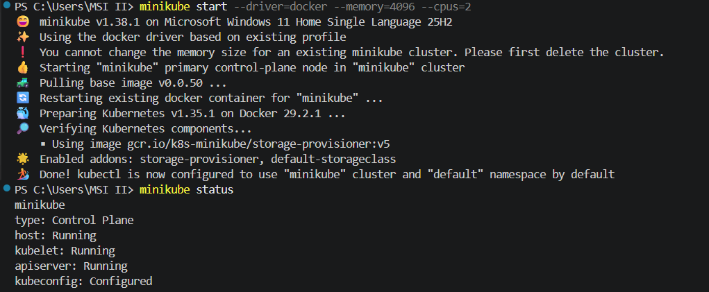

### STEP 2 — Enable Addons

```bash
minikube addons enable ingress
minikube addons enable metrics-server
minikube addons list
```

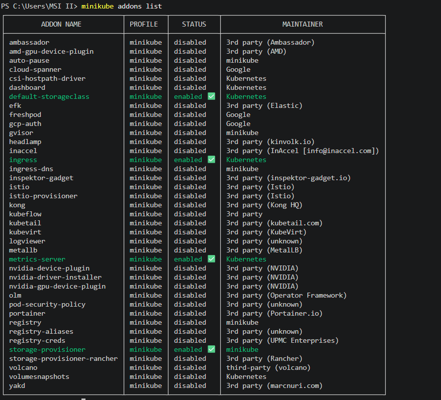

### STEP 3 — Build & Push Docker Image

```bash
docker build -t eldho10/k8s-webapp:latest app/
docker push eldho10/k8s-webapp:latest
```

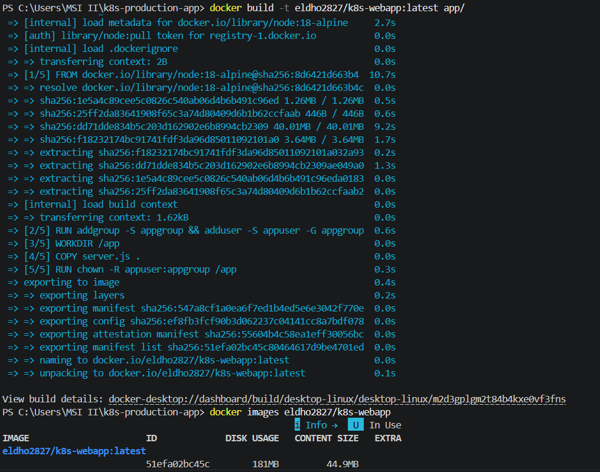

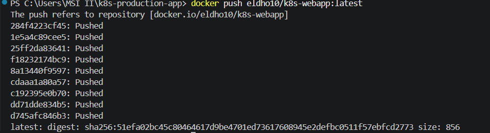

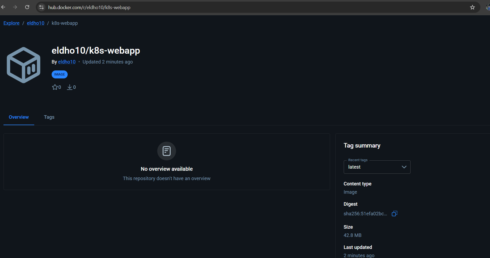

### STEP 4 — Deploy All Kubernetes Resources

```bash
kubectl apply -f k8s/base/00-namespace.yaml
kubectl apply -f k8s/base/01-configmap.yaml
kubectl apply -f k8s/base/02-secret.yaml
kubectl apply -f k8s/base/07-resource-quota.yaml
kubectl apply -f k8s/base/03-deployment.yaml
kubectl apply -f k8s/base/04-service.yaml
kubectl apply -f k8s/base/05-ingress.yaml
kubectl apply -f k8s/base/06-hpa.yaml
kubectl apply -f k8s/base/08-pdb.yaml
```

### STEP 5 — Verify Deployment

```bash
kubectl get pods -n production
kubectl get all -n production
kubectl get hpa -n production
kubectl get ingress -n production
kubectl get pdb -n production
```

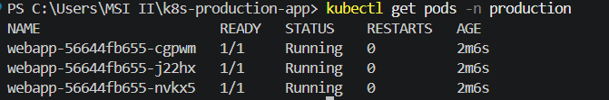

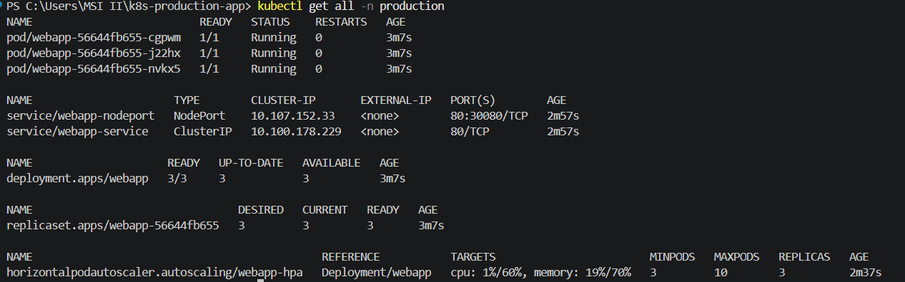

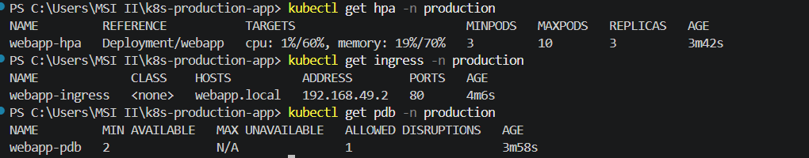

### STEP 6 — Access the Application

```bash
# Get access URL
minikube service webapp-nodeport -n production --url

# Test the app
curl.exe http://127.0.0.1:<PORT>
```

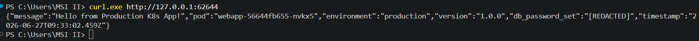

---

## 🔍 Verification Results

### ✅ Load Balancing — Requests rotating across all 3 pods

```bash
curl.exe http://127.0.0.1:<PORT>
curl.exe http://127.0.0.1:<PORT>
curl.exe http://127.0.0.1:<PORT>
```

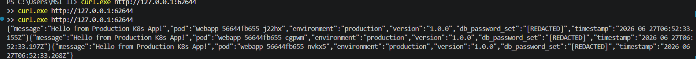

### ✅ Liveness & Readiness Probes Working

```bash
curl.exe http://127.0.0.1:<PORT>/healthz   # → {"status":"alive","uptime":1264.56}
curl.exe http://127.0.0.1:<PORT>/ready     # → {"status":"ready"}
```

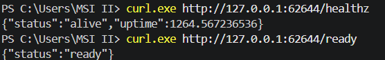

### ✅ HPA, PDB & Resource Usage

```bash
kubectl get hpa -n production
kubectl get pdb -n production
kubectl top pods -n production
```

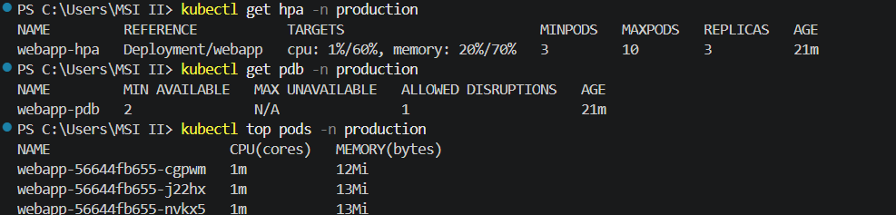

### ✅ Self-Healing — Pod automatically recreated after deletion

```bash
kubectl delete pod <pod-name> -n production
kubectl get pods -n production -w
```

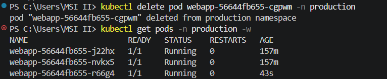

### ✅ Complete Deployment Overview

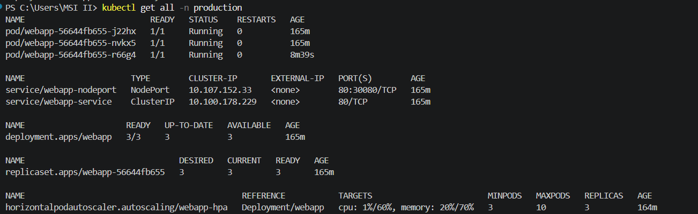

### ✅ Deployment Details (Probes, Resources, Strategy)

```bash
kubectl describe deployment webapp -n production
```

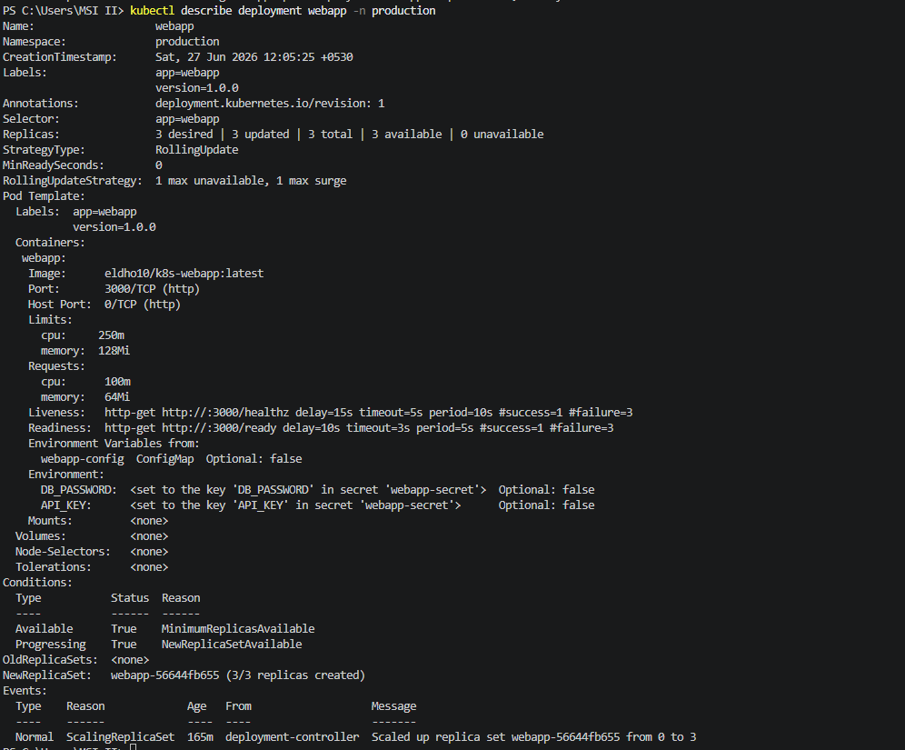

---

## 🔄 How Zero-Downtime Rolling Update Works

```
Initial:   [Pod1 v1.0] [Pod2 v1.0] [Pod3 v1.0]   ← all serving traffic

Step 1:    [Pod1 v1.0] [Pod2 v1.0] [Pod3 v1.0]
                                   [Pod4 v2.0]    ← maxSurge=1: new pod created

Step 2:    [Pod1 v1.0] [Pod2 v1.0]               ← maxUnavailable=1: Pod3 removed
                                   [Pod4 v2.0]   ← Pod4 passes readiness probe first

Step 3:    [Pod1 v1.0] [Pod2 v1.0] [Pod5 v2.0]
                                   [Pod4 v2.0]

Final:     [Pod4 v2.0] [Pod5 v2.0] [Pod6 v2.0]   ← zero downtime!
```

**Key:** The Readiness Probe ensures a new pod receives traffic ONLY after it fully starts.

```bash
# Trigger rolling update
kubectl set image deployment/webapp webapp=eldho10/k8s-webapp:v2.0 -n production
kubectl rollout status deployment/webapp -n production

# Rollback if needed
kubectl rollout undo deployment/webapp -n production
```

---

## 📊 How Each Component Contributes

| Component | Scalability | Availability | Security | Zero-Downtime |
|-----------|:-----------:|:------------:|:--------:|:-------------:|
| Deployment (3 replicas) | ✅ | ✅ | — | ✅ |
| ConfigMap | ✅ | — | ✅ | ✅ |
| Secret | — | — | ✅ | — |
| Resource Requests | ✅ | ✅ | — | ✅ |
| Resource Limits | ✅ | ✅ | ✅ | — |
| Liveness Probe | — | ✅ | — | — |
| Readiness Probe | — | ✅ | — | ✅ |
| Service (ClusterIP) | ✅ | ✅ | — | ✅ |
| Ingress | ✅ | ✅ | ✅ | — |
| HPA | ✅ | ✅ | — | — |
| ResourceQuota | — | ✅ | ✅ | — |
| PodDisruptionBudget | — | ✅ | — | ✅ |

---

## 🔧 Useful Commands

```bash
# Watch pods in real-time
kubectl get pods -n production -w

# View pod logs
kubectl logs -l app=webapp -n production --prefix=true

# Check env vars injected from ConfigMap and Secret
kubectl exec -it <pod-name> -n production -- env | grep -E "APP_ENV|PORT|DB_PASSWORD"

# Check resource usage
kubectl top pods -n production

# Describe deployment (shows probes, resources, strategy)
kubectl describe deployment webapp -n production

# Test self-healing
kubectl delete pod <pod-name> -n production
kubectl get pods -n production -w
```

---

## 🐳 Docker Image

```bash
docker pull eldho10/k8s-webapp:latest
```

Image hosted on Docker Hub: [hub.docker.com/r/eldho10/k8s-webapp](https://hub.docker.com/r/eldho10/k8s-webapp)

---

## 👤 Author

**Eldho Sabu**  
B.Voc Information Technology | AWS DevOps Intern

- 🔗 GitHub: [github.com/Eldho2827](https://github.com/Eldho2827)
- 🔗 LinkedIn: [linkedin.com/in/eldhosabu08](https://linkedin.com/in/eldhosabu08)
